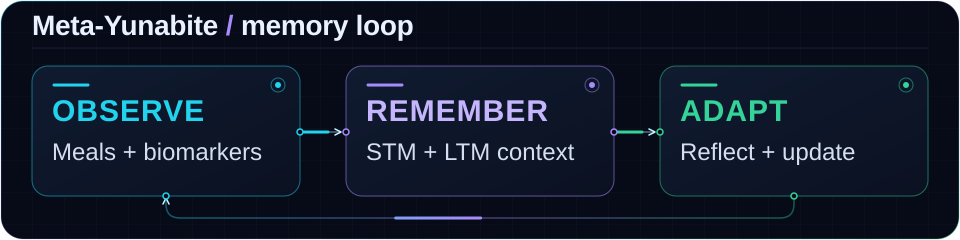

# Ananda Aditya

**R&D Lead · AI & mHealth Researcher · Product Builder**

   

[Selected work](#selected-work) &nbsp; / &nbsp; [Research](#research) &nbsp; / &nbsp; [Toolkit](#toolkit) &nbsp; / &nbsp; [Activity](#github-activity)

Singapore & Southeast Asia · AI that remembers. Products that matter.

## At a glance

I'm **Ananda**, R&D Lead at **[Meet Ventures](https://meetventures.com)** in Singapore and an AI/mHealth researcher with a Computer Science background from **Klabat University**.

My work connects **agentic AI**, **consumer healthcare**, and **startup ecosystems**. I build LLM applications with short- and long-term memory, develop products at [Yunabite](https://yunabite.ai), and support Southeast Asia startup research for **NUS and SMU faculty**.

  

Pitch Vault ecosystem growth · Yunabite research and product development

## Selected work

### Meet Ventures &nbsp; / &nbsp; R&D Lead

Startup research and ecosystem development in Singapore and Southeast Asia.

- Scaled **Pitch Vault** to **600+ founders and 200+ investors**.
- Help **KOCCA, HKSTP, and JETRO** programs enter Southeast Asian markets.
- Facilitate regional startup research for **NUS and SMU faculty**.

### [Yunabite](https://yunabite.ai) &nbsp; / &nbsp; Co-Founder & Product Lead

AI-driven consumer mHealth built on decentralized infrastructure.

- **Solana Foundation grantee**, connecting healthcare products with Web3 infrastructure.
- Researching personalized nutrition and metabolic monitoring through **Meta-Yunabite**.

### Digital Hunter &nbsp; / &nbsp; Co-Founder & CTO

Built a venture through the startup ecosystem to an acquisition and exit.

- **1000 Startup Digital** graduate.
- Patented work: **`ID EC00202203132`**.
- **Acquired and exited**.

<strong>Education & recognition</strong>

- **Computer Science**, Klabat University · **Magna Cum Laude**.
- **1st place**, CORISINDO 2022.
- **3rd place**, INDONERIS 2022.

## Research

### Meta-Yunabite

> Exploring how nutrition agents can remember context, reflect on behavior, and adapt over time.

A closed-loop agentic harness for **personalized nutrition and metabolic monitoring**, with tiered memory and self-patching prompts.

<strong>Inside the memory loop</strong>

| Layer | Role in the system |
| :--- | :--- |
| **Short-term memory** | Vision-based meal scanning and real-time biomarker logs. |
| **Long-term memory** | A persistent `Agent.md` profile, updated through trace reflection. |
| **Feedback loop** | Firestore telemetry detects behavioral drift and triggers system-prompt updates. |

**Research stack:** `FlutterFlow` · `Firebase Cloud Functions` · `Firestore` · `Gemini 3.5 Flash`

## Toolkit

 

  

<strong>Full engineering toolkit</strong>

| Focus | Technologies |
| :--- | :--- |
| **Languages** | Dart, Python, JavaScript, Java, C++ |
| **Mobile & frontend** | Flutter, FlutterFlow, React, HTML5 |
| **Backend & cloud** | Firebase, Cloud Functions, Firestore, Node.js, MongoDB, Google Cloud |
| **AI & Web3** | Gemini API, Ollama, OpenClaw, local LLMs, Solana |

## GitHub activity

[View repositories](https://github.com/aditzeb?tab=repositories) &nbsp; / &nbsp; [Explore contributions](https://github.com/aditzeb?tab=overview)

### The next idea starts with a conversation.

**AI · Digital health · Startup research**

[Portfolio](https://ananda-aditya.web.app/) &nbsp; / &nbsp; [LinkedIn](https://linkedin.com/in/aditzeb)

"Justify world with a single code."

